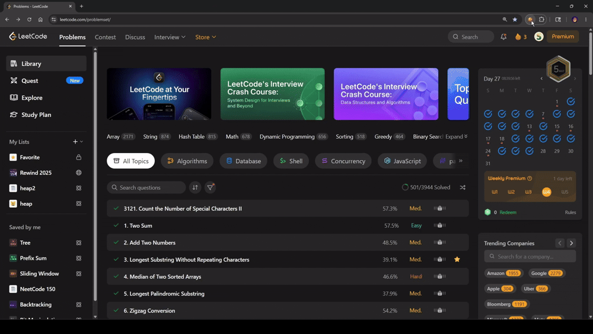

  
  <h1>Leet Blind</h1>
  
<strong>Solve the problem, not the label.</strong>

  
A Chrome extension that hides or randomizes LeetCode difficulty labels to reduce stress, bias, and premature self-judgment.

  

    
    
    
    
    
  

 

## Overview

Leet Blind is a lightweight Chrome extension that removes one of the most psychologically loaded parts of LeetCode: the difficulty label.

Instead of seeing `Easy`, `Medium`, or `Hard` before you even start thinking, you can:

- hide difficulty entirely
- randomize difficulty labels for a bias-free solving experience
- tune randomized difficulty weights from the popup UI
- toggle the extension on or off instantly

It is designed as a simple mental-performance tool for interview prep, deliberate practice, and stress reduction.

> If you solve differently after seeing the `Hard` tag, this extension is for you.

## Demo

  

## Why This Exists

Difficulty labels are useful metadata, but they also shape behavior before reasoning begins.

When a developer sees `Hard`, it can trigger hesitation, overthinking, or avoidance. When they see `Easy`, it can trigger overconfidence, impatience, or frustration if the problem feels harder than expected. In both cases, the label can distort focus before the actual work starts.

The goal is not to remove challenge. The goal is to reduce bias.

## Feature Highlights

| Feature                  | What it does                                                                                          |
| ------------------------ | ----------------------------------------------------------------------------------------------------- |
| `Hide mode`              | Replaces visible difficulty labels so you can approach the problem without pressure.                  |
| `Randomize mode`         | Swaps difficulty labels with randomized alternatives for a playful but still bias-resistant workflow. |
| `Weighted probabilities` | Adjust Easy, Medium, and Hard distribution from the popup.                                            |
| `Instant enable/disable` | Toggle the extension without uninstalling it.                                                         |
| `SPA-aware behavior`     | Reapplies logic across LeetCode page navigation using history patching and DOM observation.           |
| `Local-first settings`   | Stores preferences in `chrome.storage.local` only.                                                    |

## Installation

### Load Unpacked in Chrome

1. Clone or download this repository.
2. Open `chrome://extensions/`.
3. Enable **Developer mode**.
4. Click **Load unpacked**.
5. Select this project folder.
6. Open LeetCode and pin the extension if you want quick access to the popup.

## Usage

1. Open any supported LeetCode page.
2. Click the Leet Blind extension icon.
3. Turn the extension on or off with the top-right toggle.
4. Choose either `Hide difficulty` or `Randomize`.
5. If using randomize mode, adjust the Easy, Medium, and Hard sliders.
6. Keep the total at `100%`.
7. Click `Save settings`.

## Contributing

Contributions are welcome.

If you want to improve the project, good areas to help with include:

- DOM selector resilience for future LeetCode UI updates
- README visuals and demo assets
- accessibility polish in the popup
- automated tests for label detection and replacement behavior
- packaging and release workflow

If you open a pull request, keeping changes small and focused will make review easier.

 

  <strong>Leet Blind</strong>
   
  Practice with less pressure. Think first. Label later.

